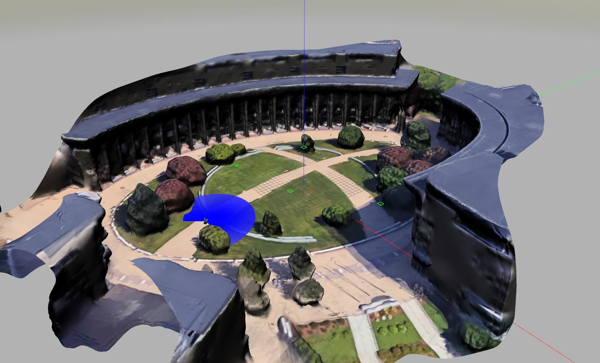

# Powered Mobility Gazebo Simulation



Gazebo simulation for the Powered Mobility project.

## Full Demo

The steps below shows how to run the demo including localization and navigation capabilities on the simulation.

First, run roscore:

```bash
roscore
```

### Option 1 : CAN Interface

This option simulates control over the CAN network by setting up a virtual CAN interface at vcan0.

```bash
rosrun pwm_bringup vcan_setup.sh
roslaunch pwm_gazebo gazebo.launch can:=true # reads velocity from vcan0
rosrun rosserial_python serial_node.py tcp
rosrun pwm_driver rnet_node -p localhost -c vcan0
```

### Option 2 : Cmd Interface

This option represents a more abstract diff-drive controller without routing over the CAN network.

```bash
roslaunch pwm_gazebo gazebo.launch can:=false
```

### Launch Features and Visualization

```bash
roslaunch pwm_bringup bringup.launch all:=true arbiter:=false transform:=false hardware:=false
roslaunch pwm_navigation rviz.launch
```
