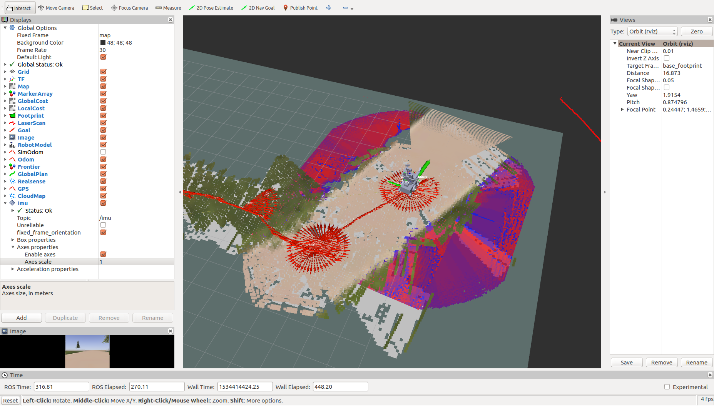
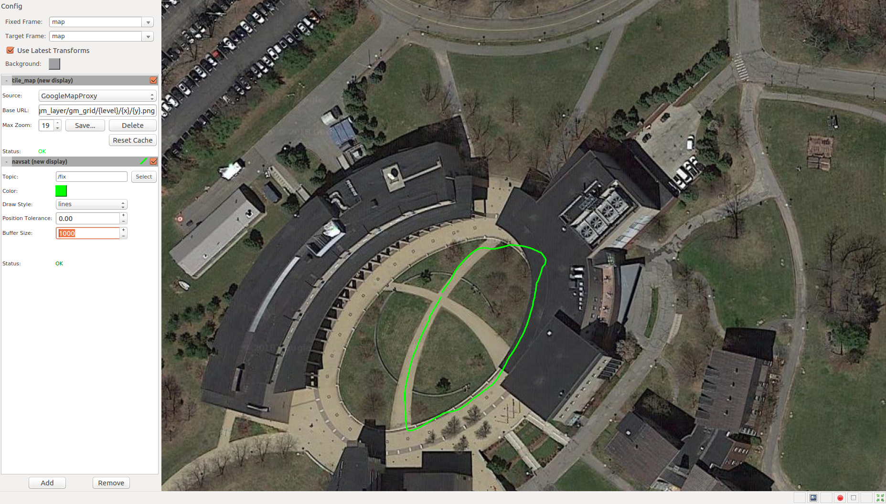

# PWM GUI

Graphical User Interface / Visualization related package for the Powered Mobility Project

## General Visualization

We use [rviz](http://wiki.ros.org/rviz) for general visualization.



```bash
roslaunch pwm_gui rviz.launch
```

## GPS Visualization

RViz does not natively support global map / satelite image based GPS coordinate visualization,
so we use [mapviz](http://wiki.ros.org/mapviz) to that purpose.



Follow the instructions [here](https://github.com/danielsnider/MapViz-Tile-Map-Google-Maps-Satellite).

(For Google Map Option) Run Map Proxy:
```bash
sudo docker run -p 8080:8080 -d -t -v ~/mapproxy:/mapproxy danielsnider/mapproxy
```

```bash
roslaunch pwm_gui mapviz.launch
```
